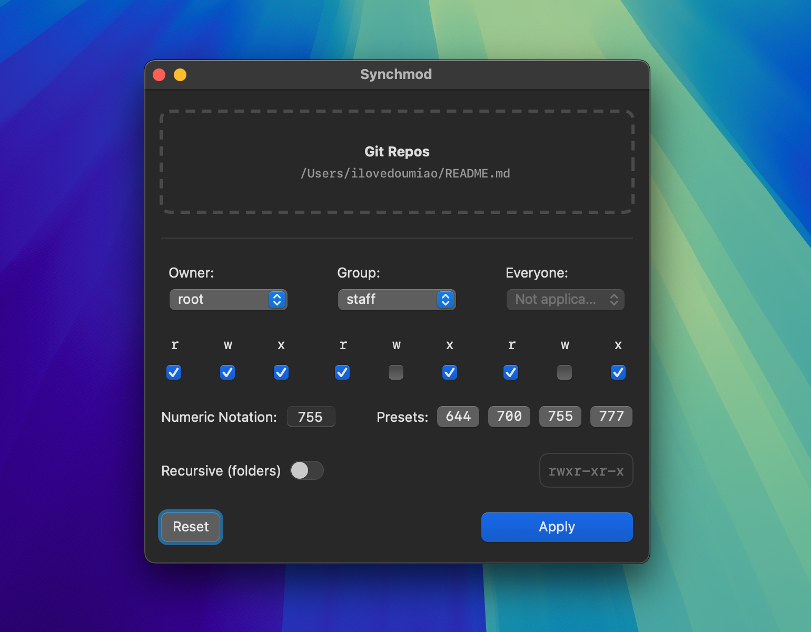

<p align="center">
    
</p>

<h1 align="center">Synchmod</h1>

<p align="center">
  
</p>

Synchmod is a clone for the beloved batChmod, but for Apple Silicon.
It's only for changing file/folder ownership and permissions right now, with no other options found in the OG app. Uses SMJobBless privileged helper tool.

## Disclaimer + TOS

Use this at your own risk. It works for me, but I can’t guarantee it will work as expected on your setup. By using Synchmod, I assume no responsibility if it messes up your system.

## Usage

#### 1) Clone the repo

```bash
git clone https://github.com/ilovedoumiao/synchmod.git
```

#### 2) Open in Xcode

Project file: `Synchmod.xcodeproj`

#### 3) Signing

Change the targets' Team and Signing Certificate with your Apple Developer account/team as `SMJobBless` requires proper signing.

## Elevated Privileges

Synchmod will ask for your password on first launch first apply. This is to install the helper tool in so that it can makes your changes if `sudo` is required (i.e. changing owner from `root`, etc)

They will be installed in the following locations:
```
\Library\PrivilegedHelperTools
\Library\LaunchDaemons
```

### Notes

You may need to run the included `SMJobBlessUtil.py` after building to update the `Info.plist` identifier if the app fails to enact the changes.

[Credits: mikeyh](https://gist.github.com/mikeyh/89a1e2ecc6849ff6056b7391c5216799)

I've set the project to build for only `arm64` so change accordingly if you need a Universal build.


## Support
If you find this useful, [buying me a coffee](https://buymeacoffee.com/coffeeguzzler) ☕️ to fuel my day will be very much appreciated.
